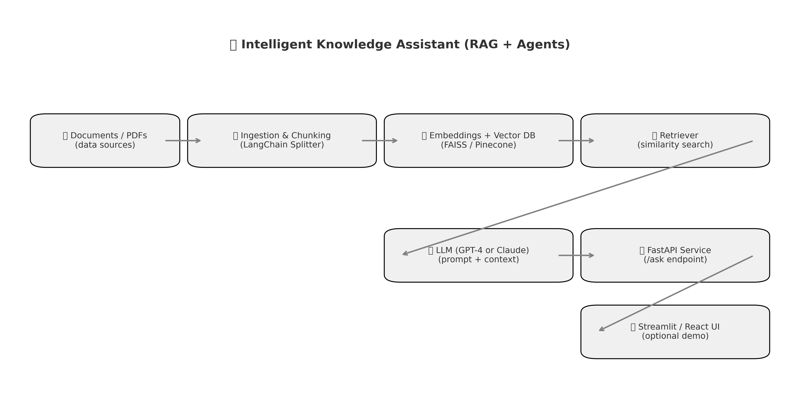

# 🧠 Intelligent Knowledge Assistant (RAG + Agents)



## 📘 Overview
A retrieval‑augmented AI system that answers natural‑language questions over custom documents. It combines text ingestion, embedding, retrieval, and LLM‑based reasoning through an API and optional UI.

---

## 🧩 System Flow
| Stage | Description |
|--------|--------------|
| **1. Documents / PDFs** | Source material: policies, papers, notes, etc.  |
| **2. Ingestion & Chunking** | Converts PDFs or text into manageable chunks using LangChain’s splitter. |
| **3. Embedding & Vector DB** | Generates embeddings with OpenAI or Hugging Face and stores them in FAISS or Pinecone. |
| **4. Retriever** | Performs similarity search to find the most relevant document segments. |
| **5. LLM Generation** | Uses GPT‑4 or Claude to compose coherent answers using retrieved context. |
| **6. FastAPI Layer** | Exposes a `/ask` endpoint for client or UI requests. |
| **7. Streamlit / React UI** | Optional web interface for interactive use or demos. |

---

## ⚙️ Configuration

The system supports both **Ollama (free, local)** and **OpenAI** for LLM generation. Configure in `.env`:

```bash
# Use Ollama (FREE - runs locally)
LLM_PROVIDER=ollama
OLLAMA_BASE_URL=http://127.0.0.1:11434
OLLAMA_MODEL=deepseek-r1:8b

# Or use OpenAI (requires API credits)
# LLM_PROVIDER=openai
# OPENAI_API_KEY=sk-your-key-here
```

## ⚙️ Run Locally

### Step 1: Ingest Documents and Create Embeddings
```bash
python src/ingest.py          # Load and chunk PDFs from data/
python src/embed_store.py     # Create FAISS vector store (uses free local embeddings)
```

### Step 2: Choose Your Interface

**Option A: Streamlit UI (Recommended - with conversational memory)**
```bash
streamlit run ui/app.py
# Or use the shortcut:
./run_ui.sh
```
Features:
- 💬 Interactive chat interface
- 🧠 Conversational memory (remembers past questions)
- 📜 Conversation history sidebar
- 📄 Source document citations

**Option B: FastAPI (REST API)**
```bash
uvicorn src.api:app --reload
```
Then open `http://127.0.0.1:8000/docs` for the Swagger API UI.

**Option C: Command Line**
```bash
python src/generator.py
```

---

## 🚀 Next Steps
- Add embedding cache for performance.
- Integrate evaluation (RAGAS or LLM‑as‑a‑judge).
- Add a LangChain Agent for summarization + reasoning.
- Deploy via Render or Hugging Face Spaces.

## 💡 Features

- ✅ **100% Free Operation**: Uses local Ollama + HuggingFace embeddings (no API costs)
- ✅ **Conversational Memory**: Streamlit UI remembers conversation history
- ✅ **Flexible LLM Support**: Switch between Ollama and OpenAI via config
- ✅ **Source Citations**: Shows which documents were used to generate answers
- ✅ **Multiple Interfaces**: Streamlit UI, REST API, or command line
- ✅ **Easy Setup**: Simple environment variable configuration

---

This project demonstrates practical RAG implementation skills for AI Engineer roles.
